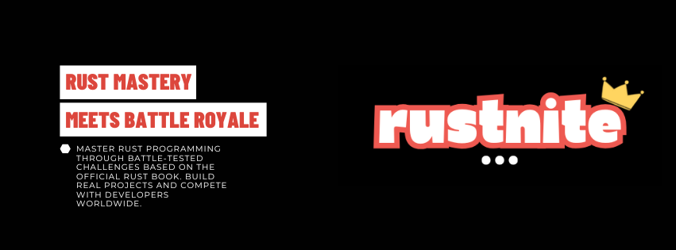

# 🦀 Rustnite - Battle-Royale Rust Learning Platform

> Master Rust programming through gamified challenges and compete with developers worldwide!




## 🚀 Features

### 🎮 Gamified Learning Experience
- **Battle-Royale Theme**: Fortnite-inspired design with gaming aesthetics
- **XP & Leveling System**: Earn experience points and level up as you learn
- **Achievement Badges**: 30+ unique badges for various accomplishments
- **Learning Streaks**: Maintain daily learning streaks for bonus rewards
- **Global Leaderboards**: Compete with developers worldwide

### 📚 Comprehensive Rust Curriculum
- **20 Interactive Lessons**: Based on the official Rust Book
- **Difficulty Progression**: Beginner → Intermediate → Advanced
- **Real Code Execution**: Run Rust code with live compiler integration
- **Monaco Code Editor**: Professional IDE experience in the browser
- **Progress Tracking**: Visual progress indicators and completion stats

### 🏗️ Real-World Projects
- **6 Hands-on Projects**: CLI tools, web servers, system programs
- **Prerequisites System**: Unlock projects by completing lessons
- **Portfolio Building**: Showcase your completed projects

### 👥 Social Features
- **Code Sharing**: Share your solutions with the community
- **User Profiles**: Customizable profiles with social links
- **Following System**: Follow other developers and see their progress
- **Activity Feeds**: Real-time updates on community activity
- **Public Profiles**: Optional public visibility for networking

### Mobile-First Design
- **Responsive Layout**: Perfect experience on all devices
- **Mobile Navigation**: Collapsible sidebar for mobile users
- **Touch-Friendly**: Optimized for touch interactions
- **Progressive Web App**: Install as a native app

### Technical Excellence
- **Pure PHP Backend**: No frameworks, lightweight and fast
- **Real-time Updates**: Live leaderboards and activity feeds
- **Security First**: Input validation and SQL injection protection
- **Docker Support**: Optional containerized Rust execution
- **API Integration**: Rust Playground API for code execution

## Installation

### Prerequisites
- PHP 7.4+ with PDO MySQL extension
- MySQL 5.7+ or MariaDB 10.3+
- Web server (Apache/Nginx)
- Optional: Docker for real code execution

### Quick Setup

1. **Clone the repository**
   ```bash
   git clone https://github.com/nia-cloud-official/rustnite.git
   cd rustnite
   ```

2. **Configure database**
   ```bash
   cp .env.example .env
   # Edit .env with your database credentials
   ```

3. **Import database schema**
   ```bash
   mysql -u username -p database_name < setup.sql
   ```

4. **Configure web server**
   - Point document root to the project directory
   - Ensure PHP has write permissions for session storage

5. **Update configuration**
   ```php
   // config.php
   define('DB_HOST', 'your_host');
   define('DB_NAME', 'your_database');
   define('DB_USER', 'your_username');
   define('DB_PASS', 'your_password');
   define('PAYPAL_DONATE_URL', 'your_paypal_link');
   ```

### Docker Setup (Optional)

For real Rust code execution:

```bash
# Install Docker
curl -fsSL https://get.docker.com -o get-docker.sh
sh get-docker.sh

# Pull Rust image
docker pull rust:1.70

# Test execution
docker run --rm rust:1.70 rustc --version
```

## 🎯 Usage

### For Learners

1. **Register an Account**
   - Create your Rustnite warrior profile
   - Set up your learning preferences

2. **Start Learning**
   - Begin with beginner lessons
   - Progress through the Rust Book curriculum
   - Complete hands-on coding challenges

3. **Build Projects**
   - Unlock real-world projects
   - Build CLI tools, web servers, and system programs
   - Showcase your work in your profile

4. **Compete & Connect**
   - Climb the global leaderboards
   - Share your code solutions
   - Follow other developers
   - Earn achievement badges

### For Administrators

1. **Content Management**
   - Add new lessons via database
   - Configure XP rewards and difficulty levels
   - Manage user accounts and progress

2. **Community Moderation**
   - Monitor shared code snippets
   - Manage user reports and feedback
   - Update achievement requirements

## 🏆 Achievement System

### Learning Milestones
- 🚶 **First Steps**: Complete your first lesson
- 🎓 **Dedicated Learner**: Complete 10 lessons
- 🔨 **Rust Apprentice**: Complete 15 lessons
- 🔧 **Rust Journeyman**: Complete 20 lessons

### XP Achievements
- ⭐ **XP Hunter**: Earn 1,000 XP
- 🏆 **XP Master**: Earn 3,000 XP
- 👑 **XP Legend**: Earn 5,000 XP
- 💎 **XP Overlord**: Earn 10,000 XP

### Streak Achievements
- 📅 **Consistent Learner**: 3-day streak
- 🔥 **Dedicated Student**: 7-day streak
- ⚡ **Learning Machine**: 14-day streak
- 🚀 **Unstoppable Force**: 30-day streak

### Special Achievements
- 🌅 **Early Bird**: Complete lesson before 8 AM
- 🌙 **Night Owl**: Complete lesson after 10 PM
- 🏁 **Weekend Warrior**: Learn on weekends
- ⭐ **Perfect Week**: Learn every day for a week

## 🔧 API Endpoints

### Code Execution
```http
POST /api/execute.php
Content-Type: application/json

{
  "code": "fn main() { println!(\"Hello, Rustnite!\"); }",
  "lesson_id": 1
}
```

### Leaderboard
```http
GET /api/leaderboard.php

Response:
{
  "success": true,
  "leaderboard": [...],
  "recent_activity": [...],
  "weekly_champions": [...]
}
```

## 🎨 Customization

### Themes
The platform uses a dark gaming theme by default. Customize colors in `includes/header.php`:

```css
:root {
  --primary-color: #FF6B35;
  --secondary-color: #1A1A1A;
  --accent-color: #2A2A2A;
}
```

### Branding
Update branding elements:
- Logo: Replace favicon and sidebar icon
- Name: Update `APP_NAME` in `config.php`
- Colors: Modify CSS custom properties
- GitHub links: Update repository URLs

## 🤝 Contributing

We welcome contributions! Here's how to get started:

1. **Fork the repository**
2. **Create a feature branch**
   ```bash
   git checkout -b feature/amazing-feature
   ```
3. **Make your changes**
   - Follow PSR-12 coding standards
   - Add comments for complex logic
   - Test your changes thoroughly
4. **Commit your changes**
   ```bash
   git commit -m "Add amazing feature"
   ```
5. **Push to your branch**
   ```bash
   git push origin feature/amazing-feature
   ```
6. **Open a Pull Request**

### Development Guidelines

- **Code Style**: Follow PSR-12 PHP standards
- **Security**: Validate all inputs, use prepared statements
- **Performance**: Optimize database queries, minimize HTTP requests
- **Accessibility**: Ensure WCAG 2.1 AA compliance
- **Mobile**: Test on various screen sizes

## 📊 Database Schema

### Core Tables
- `users`: User accounts and profiles
- `lessons`: Rust learning content
- `user_progress`: Learning progress tracking
- `badges`: Achievement definitions
- `user_badges`: Earned achievements

### Social Features
- `code_shares`: Shared code snippets
- `code_likes`: Code snippet likes
- `user_follows`: Following relationships
- `notifications`: User notifications

## 🔒 Security

### Implemented Protections
- **SQL Injection**: Prepared statements throughout
- **XSS Prevention**: Input sanitization and output escaping
- **CSRF Protection**: Token validation for forms
- **Code Execution**: Sandboxed Docker containers
- **Input Validation**: Server-side validation for all inputs

### Security Best Practices
- Regular security updates
- Strong password requirements
- Session management
- Rate limiting for API endpoints
- Content Security Policy headers

## 📈 Performance

### Optimization Features
- **Database Indexing**: Optimized queries with proper indexes
- **Caching**: Session-based caching for user data
- **Lazy Loading**: Progressive content loading
- **Image Optimization**: Compressed assets
- **Minification**: CSS and JavaScript optimization

### Monitoring
- Error logging and monitoring
- Performance metrics tracking
- User analytics and engagement
- Database query optimization

## 🌟 Roadmap

### Upcoming Features
- [ ] **Advanced Projects**: Multi-file Rust projects
- [ ] **Code Reviews**: Peer code review system
- [ ] **Mentorship**: Connect learners with mentors
- [ ] **Certificates**: Completion certificates
- [ ] **API Challenges**: REST API building challenges
- [ ] **Team Competitions**: Group learning challenges

### Long-term Vision
- [ ] **Mobile Apps**: Native iOS and Android apps
- [ ] **Video Lessons**: Integrated video tutorials
- [ ] **Live Coding**: Real-time collaborative coding
- [ ] **Job Board**: Rust job opportunities
- [ ] **Conferences**: Virtual Rust conferences

## 📄 License

This project is licensed under the MIT License - see the [LICENSE](LICENSE) file for details.

## 🙏 Acknowledgments

- **Rust Team**: For creating an amazing programming language
- **Rust Book**: Official Rust documentation and learning materials
- **Monaco Editor**: Microsoft's excellent code editor
- **Tailwind CSS**: Utility-first CSS framework
- **Font Awesome**: Beautiful icons and graphics
- **Community**: All the amazing developers who contribute

## 📞 Support

### Getting Help
- 📖 **Documentation**: Check this README and code comments
- 🐛 **Bug Reports**: Open an issue on GitHub
- 💡 **Feature Requests**: Discuss in GitHub Discussions
- 💬 **Community**: Join our Discord server
- 📧 **Contact**: Email us at support@rustnite.dev

### Donation
Support the project development:
- 💝 **PayPal**: [Donate via PayPal](https://paypal.me/yourusername)
- ☕ **Buy me a coffee**: [Support on Ko-fi](https://ko-fi.com/yourusername)
- ⭐ **GitHub Star**: Star the repository to show support

---

<div align="center">

**Built with ❤️ for the Rust community**

[🌟 Star on GitHub](https://github.com/nia-cloud-official/rustnite) • 
[🐛 Report Bug](https://github.com/nia-cloud-official/rustnite/issues) • 
[💡 Request Feature](https://github.com/nia-cloud-official/rustnite/discussions)

</div>