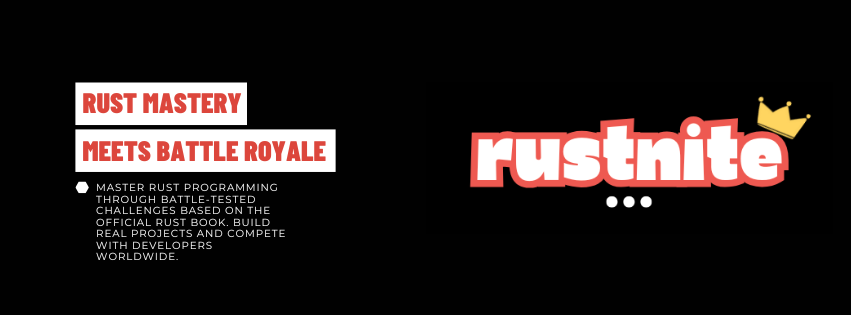

# ⚡ Rustnite — Battle-Royale Coding Arena

> A Twitch-inspired, multi-language coding arena where you level up by solving challenges, competing in battle royales, and learning with an AI tutor — all powered by **Big Pickle** 🤖



---

## 🚀 Features

### 🎮 Twitch-Inspired Arena
- **Live sidebar UI** — dark theme, streamer-style layout, real-time notifications
- **Animations everywhere** — confetti, progress rings, smooth transitions
- **Glowing gradients & neon accents** — that premium gaming feel
- **Mobile-first responsive** — collapsible sidebar, touch friendly

### 🧠 AI-Powered Everything (Big Pickle)
- **AI Tutor** — ask anything, get real answers (no canned responses)
- **Auto-generated lessons** — lessons are created on-the-fly by the AI when none exist
- **Auto-generated mini-games** — 4 game types created dynamically: Code Rush, Bug Squasher, Syntax Sprint, Pattern Match
- **Daily challenges** — automatically generated every day
- **Feed posts & content** — AI-assisted community engagement

### 🌐 Multi-Language Support
| # | Language | Icon |
|---|----------|------|
| 1 | Rust | `🦀` |
| 2 | Python | `🐍` |
| 3 | JavaScript | `🟨` |
| 4 | TypeScript | `🔷` |
| 5 | Go | `🔵` |
| 6 | Java | `☕` |
| 7 | C++ | `⚙️` |
| 8 | C | `⚡` |

### ⚔️ Battle Royale Systems
- Real-time coding battles with up to 50 players
- XP rewards for wins & participation
- Leaderboards per language
- Elimination-style competition rounds

### 🎯 Gamification
- **XP & Leveling** — earn XP from lessons, challenges, battles, mini-games
- **Streaks** — daily login streaks with bonus rewards
- **Badges** — 30+ achievements to unlock
- **Leaderboards** — global & per-language rankings
- **Daily Challenges** — unique challenges refreshed every 24h

### 🕹️ Playable Mini-Games
| Game | Description |
|------|-------------|
| 🏃 Code Rush | Race to write correct code under time pressure |
| 🐛 Bug Squasher | Find and fix bugs in code snippets |
| ⚡ Syntax Sprint | Quickly identify syntax errors |
| 🧩 Pattern Match | Match code patterns to descriptions |

### 👥 Social Features
- **Feed page** — post ideas, blogs, questions, share code
- **User profiles** — customizable with XP, level, badges, streak
- **Follow system** — follow other developers
- **Notifications** — real-time in-app notifications with dropdown
- **Code sharing** — share solutions with the community

### 🔐 Authentication
- **Email/Password** — standard registration & login
- **GitHub OAuth** — one-click login with GitHub

### ⚙️ Real Developer Tools
- **Real code execution** — actual compilation & runtime (not simulated)
- **Monaco Editor** — professional code editing (VS Code inside the browser)
- **Syntax highlighting** — per-language theming
- **Formatting & linting** — integrated where available

---

## 🏗️ Tech Stack

| Layer | Technology |
|-------|-----------|
| **Backend** | PHP 8+ (no framework) |
| **Database** | MariaDB / MySQL |
| **Frontend** | Tailwind CSS + Font Awesome |
| **Editor** | Monaco Editor (VS Code) |
| **AI** | OpenCode Big Pickle (`big-pickle` model) |
| **Code Execution** | Real compilers (Rustc, Python3, Node, GCC, G++, Javac, Go) |
| **Auth** | GitHub OAuth + native sessions |
| **Hosting** | Wasmer Edge |

---

## 🔧 Quick Start

### Prerequisites
- PHP 8.0+ with PDO MySQL & cURL extensions
- MariaDB 10.3+ or MySQL 5.7+
- Web server (Apache / Nginx)
- Compilers/tools for languages you want to support (optional, code falls back to simulation if not available)

### Setup

1. **Clone the repo**
   ```bash
   git clone https://github.com/nia-cloud-official/rustnite.git
   cd rustnite
   ```

2. **Configure database & app**
   ```php
   // config.php — set your database credentials
   define('DB_HOST', 'your_host');
   define('DB_NAME', 'rustnite');
   define('DB_USER', 'your_user');
   define('DB_PASS', 'your_password');
   ```

3. **Set your OpenCode API key** (get one at [opencode.ai](https://opencode.ai))
   ```php
   // config.php
   define('OPENCODE_API_KEY', 'sk-your-key-here');
   ```

4. **(Optional) Set up GitHub OAuth**
   - Create an OAuth App at https://github.com/settings/developers
   - Set callback URL to `https://yourdomain.com/index.php?page=login&github_callback=1`
   - Fill in `GITHUB_CLIENT_ID` and `GITHUB_CLIENT_SECRET` in `config.php`

5. **Point your web server** to the project directory — the schema auto-migrates on first load.

---

## 🤖 AI Tutor

The **Big Pickle AI Tutor** is available on every page. Ask it anything:

- "Explain closures in Rust"
- "Debug this Python function"
- "Generate a React component"
- "What's the difference between C and Go?"

It uses the **OpenCode Zen API** (`https://opencode.ai/zen/v1/chat/completions`) with the `big-pickle` model — no canned responses, real AI answers.

---

## 📊 Database

The schema auto-migrates via `includes/db.php`. Core tables:

| Table | Purpose |
|-------|---------|
| `users` | Accounts, XP, level, streak |
| `lessons` | Coding lessons (auto-generated) |
| `user_progress` | Per-lesson completion tracking |
| `mini_games` | Game configs & leader data |
| `mini_game_scores` | High scores per user |
| `daily_challenges` | Auto-generated daily challenges |
| `notifications` | In-app notification queue |
| `feed_posts` | Community feed (blogs, questions, ideas) |
| `badges` / `user_badges` | Achievement system |
| `battle_royale_*` | Battle royale matches & participants |

---

## 🌟 Roadmap

- [ ] **Live coding battles** — real-time multiplayer with WebSockets
- [ ] **Team arenas** — squad-based coding competitions
- [ ] **Custom avatars & cosmetics** — earned through play
- [ ] **Tournament mode** — bracket-style coding championships
- [ ] **Video tutorials** — integrated learning media
- [ ] **Mobile app** — native iOS / Android

---

## 🤝 Contributing

PRs welcome! Keep the Twitch vibe alive, make the animations pop, and never hardcode anything the AI can generate.

1. Fork the repo
2. Create a feature branch (`git checkout -b feature/cool-stuff`)
3. Commit your changes (`git commit -m "Add cool stuff"`)
4. Push (`git push origin feature/cool-stuff`)
5. Open a Pull Request

---

## 📄 License

MIT — see [LICENSE](LICENSE).

---

## 🙏 Acknowledgments

- **OpenCode** — for Big Pickle, the AI that makes this platform actually smart
- **Twitch** — for the UI/UX inspiration
- **Monaco Editor** — Microsoft's incredible code editor
- **Tailwind CSS** — utility-first CSS done right
- **Font Awesome** — the icons that tie it all together
- **You** — for coding, competing, and leveling up 🚀

---

<div align="center">

**Built with ⚡ and 🤖 — never stop shipping**

[🌟 Star on GitHub](https://github.com/nia-cloud-official/rustnite) •
[🐛 Report Bug](https://github.com/nia-cloud-official/rustnite/issues) •
[💡 Request Feature](https://github.com/nia-cloud-official/rustnite/discussions)

</div>
